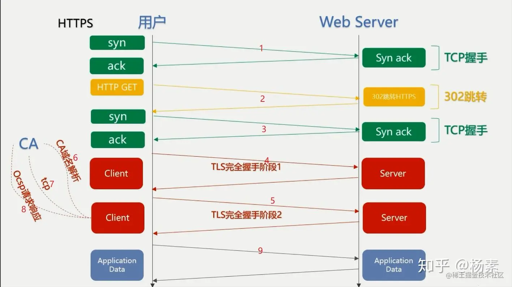
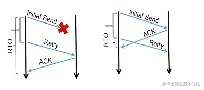
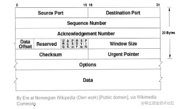
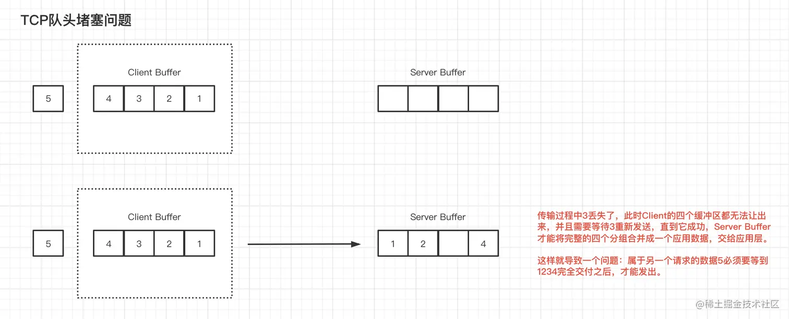
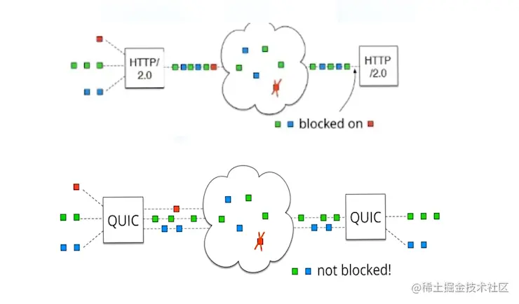
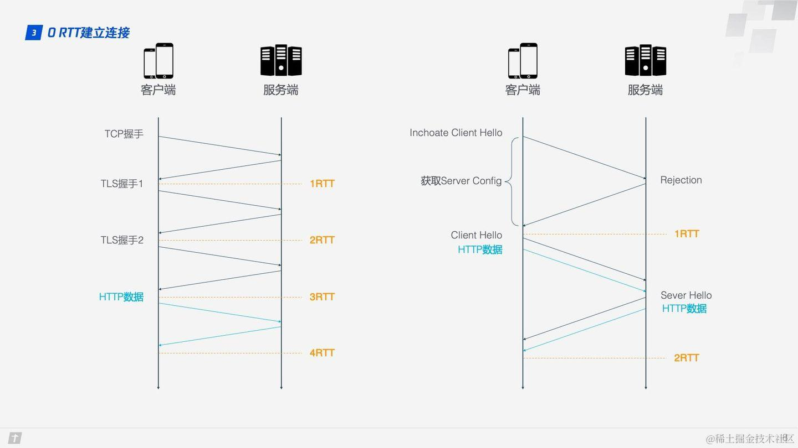
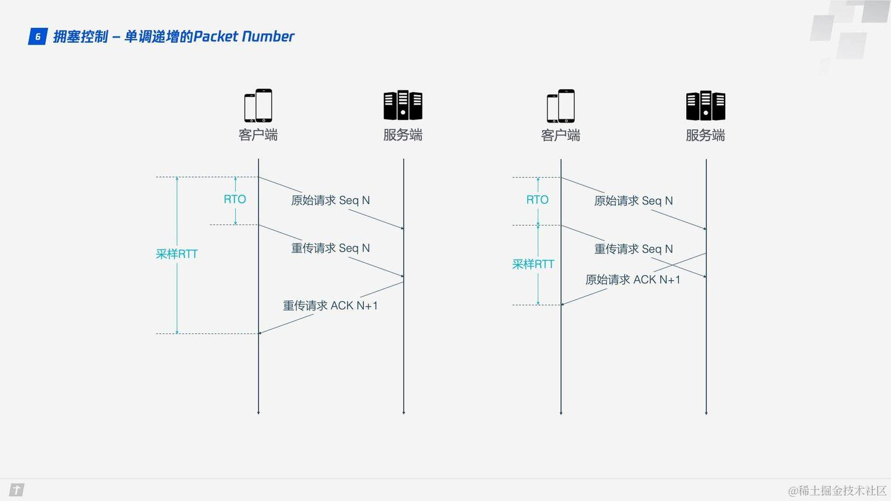
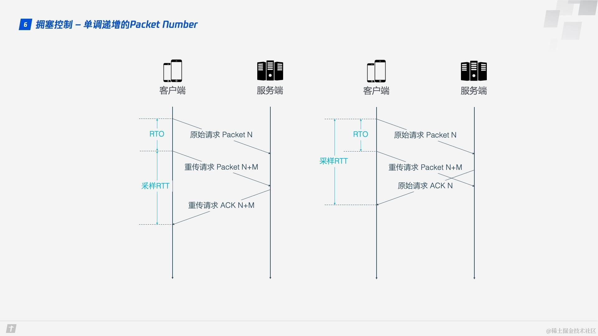
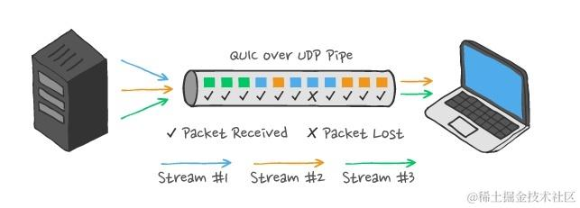
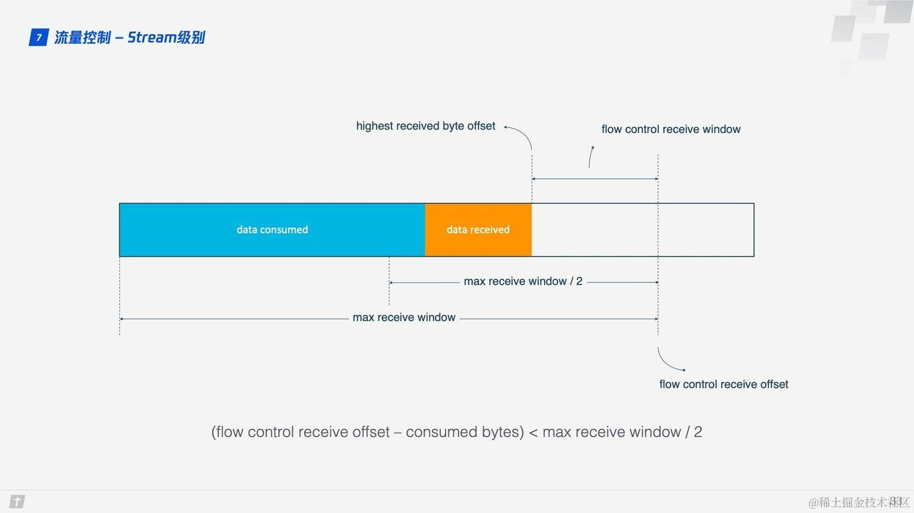

# 1 TCP协议

传统架构上的应用开发，基本上都是在TCP （传输控制协议） 和UDP （用户数据协议） 之上二选一，这二者都基于IP协议开发，区别在于TCP提供面向字节流的可靠传输服务，而UDP则提供面向报文的尽力交付服务。但是相同之处在于二者都是基于IP协议实现的，在真正传输时，无论是TCP的数据块还是UDP报文都会被封装在一个IP分组的荷载中进行传输。
TCP将上层的数据看做是一串无序的字节流，会按照一定的大小为它切块，划分缓冲区。其中每一块都会使用一个序号来进行标注。而面向报文是指，UDP不会将上层的数据做进一步的划分，而是将它完整地转发出去。
## 1.1 TCP协议的优缺点

  TCP特性： 根据应用区分（端口区分）、实现可靠数据传输，拥塞控制和流量控制。
- 优点： 开发效率高、不需要额外考虑差错控制。
- 缺点：TCP本身的特性制约了传输的效率，TCP的管理是由操作系统实现的，更新迭代的成本较高

实际上，HTTP将TCP作为下层的协议，它在1.1/2.0等版本中做了大量的工作，试图提高HTTP的效率，但是受限于TCP固有的特性，难以取得突破。
## 1.2 TCP 可靠传输原理
TCP通过序号、确认、重传来保证可靠传输。

TCP端到端之间，采用缓冲区来暂存正在发送的数据，一旦数据发送出现问题（丢包导致的超时、冗余ACK等等），TCP发送端能够及时地从缓冲区中选择数据重发。
TCP为每一个TCP报文分配一个序号 seq = a，接收方接收到序号为a的报文，就响应一个ack = a + 1的ACK响应报文来确认，如果发生了丢包导致的计时器超时、收到冗余ACK，那么会触发重传机制，重发对应的数据包。
## 1.3 TCP存在的一些问题
### 1.3.1 TCP连接耗时严重
我们知道，基于TCP的HTTP/2链接，需要经过三次握手，这时候消耗掉一个RTT（如下图1），而HTTPs在TCP的基础上，又使用了TLS1.2进行数据加密（如下图4、5），需要消耗2个RTT，这样一来，在建立连接时，光是TCP + TLS过程就需要消耗掉3个RTT的时间。

这其中最大的问题就是，TCP的确认帧需要经过一个完整的RTT才可能被接收到，而TCP一个时刻发送的数据的数量会被拥塞窗口所限制，假设ssthresh设置为16，那么甚至需要5个RTT才能跑满基础的拥塞窗口，如果现实网络会在32时产生拥塞，那么根据拥塞避免算法，需要5 + 16个RTT才能最大化利用网络的带宽和吞吐量。
### 1.3.3 TCP序号的二义性
TCP协议采用序号来标记TCP发送的数据，当发送方发送seq = a的报文到接收端时，接收方会采用一个ack = a + 1的ACK报文来响应这个数据，当发送方接到这个ack = a + 1的应答报文时，就说明该帧被成功接收了。

如上图，TCP在Initial阶段发出的帧序号为a，而经过一段时间之后，没有收到ACK，此时触发超时重传，过了一会儿收到了一个ACK帧，但是ACK帧的内容是a + 1，此时无法确认该a + 1是对initial send还是retry帧的确认（图左是对Retry的确认，图右是对Initial Retry的确认，但是到达的比较晚，已经触发了超时重传）。导致最终的超时时间计算并不准，后续超时算法的迭代时间就会产生问题，比如 触发超时重传的时间可能会不准。
### 1.3.4 TCP内核态实现问题
TCP的处理依赖于操作系统，我们难以对它进行升级。虽然TCP头部中，提供一个Option字段，它提供了最长40字节的额外数据空间，我们可以将一些升级字段放置在Options中。

但是这个空间不仅仅不够用，而且一些系统的防火墙会将Options中的一些字段信息过滤掉，这是我们应用层难以控制的。
### 1.3.5 TCP队头堵塞的问题
由于TCP必须在一个请求的所有分片完成之后，才能将所有的数据提交给上层，所以TCP存在队头阻塞的问题。如下的缓冲区，如果3始终无法完成交付，那么会导致该TCP链接一直在处理3所述的应用层请求（通常是HTTP）。

# 2 Quic协议
&ensp;&ensp;&ensp;&ensp;Quic和HTTP协议一样采用流的概念来管理请求，但是它不会存在TCP头端阻塞的问题，因为本身不存在请求队列这一结构，也不会存在有序的流执行的顺序，自然也不会阻塞.

- Quic支持快速握手，如果搭配TLS1.3协议，在之前建立过连接的情况下，只需要0个RTT即可开始发送数据。（HTTP/2需要3个RTT）
- 高效的差错恢复/无状态重试，以及可插拔的拥塞控制机制
- 可支持连接迁移技术
- 基于用户态实现，不需要更新操作系统即可更新Quic相关的内容。

## 2.1 Quic的实现细节

  &ensp;&ensp;&ensp;&ensp;HTTP/2采用 IP地址+端口的 套接字来标记一个终端。但无论是IP地址还是端口号，可能都是会发生改变的，IP地址可能会因为我们的手机接入AP或者是WiFi就发生改变，或者是NAT路由的私有/公有地址映射发生改变。而端口可能因为端口被占用而发生改变。因此，用这种方式来标记一个处于稳定情况下的连接会话是可行的，但是一旦用户的网络环境频繁发生变化，那么将会无法维护一个稳定的TCP连接。

- 连接迁移

  而Quic抛弃了原有的传输层四元组（两个套接字），采用了一个Connection ID的形式来标记端。只要对方的IP地址不变（比如服务器），使用Connection ID，能够无缝地实现发送端的地址更改，在不需要建立连接的情况下，快速实现连接迁移。（因为不需要重新握手）

- 快速握手

  本义指的是QUIC不需要额外建立连接，初次握手需要1个RTT进行握手，而后续情况下，可以将连接的一些细节保存，直接复用上一次连接的数据实现0-RTT快速握手。

- 高效地恢复丢失

  TCP的SACK选项能够告诉发送方已经接收到的连续 Segment 的范围，方便发送方进行选择性重传。TCP最多只能提供30个字节的空间给sAck，而每一个sack Block的长度为8，Sack Option头部为2个字节，这样一来，30 - 2 = 28，28 / 8 = 3，最多只能提供3个完整的Block给sAck字段使用。而ACK帧可以同时提供256个Ack Block，在丢包率比较高的网络下，更多的 Sack Block 可以提升网络的恢复速度，减少重传量。

- 解决TCP序号二义性问题

  无论是正常还是重传的数据，其序号本身一定是单调递增的，这样一来即使是不同的序号也有可能数据内容是相同的（一个是正常帧，一个是超时重传帧），这样一来统计的超时时间是准确的。

- 安全性

  QUIC与TLS1.3配合，实现身份认证，密钥共享。而TLS1.3通过QUIC传递数据包。支持1-RTT完成TLS握手，在建立握手之后，最优情况下，支持0-RTT恢复握手，在建立连接时节省了往返时间。

## 2.2 Quic协议术语
- 数据包（Packet）：QUIC 协议中一个完整可处理的单元，可以封装在UDP 数据报（datagram）中。多个QUIC 数据包（packets）可以封装在一个UDP 数据报（datagram）中。
- 帧（Frame）：QUIC 数据包（packet）的有效载荷（payload）。
- 端点（Endpoint）：在QUIC 连接中生成、接收和处理 QUIC 数据包（packets）的终端。QUIC中只有两端点（endpoints）：客户端（client）和服务端（server）。
- 客户端（Client）: 创建QUIC 连接的端点。
- 服务端（Server）: 接收QUIC 连接的端点。
- 地址（Address）：未经限定使用时，表示网络路径一端的IP 版本、IP地址和 UDP 端口号的元组。
- 连接ID（Connection ID）： 用于标识端点 QUIC 连接的一种标识符。每个端点（endpoint）为其对端（peer）选择一个或多个连接 ID，将其包含在发送到该端点的数据包（packets）中。这个值对peer 不透明。
- 流（Stream）：QUIC 连接中有序字节的单向（unidirectional）或双向（bidirectional）通道。一个QUIC 连接可以同时携带多个流。
应用程序（Application）：使用QUIC 发送或者接收数据的实体。

## 2.3 UDP层
- UDP荷载大小 : 荷载大小受限于3个对象：QUIC协议规定；路径MTU；终端接受能力

    1. QUIC不能运行在不支持1200字节的单个UDP传输网络路径上, QUIC规定initial包大小不得小于1200，如果数据本身不足1200 (比如initial ack)，那么需要用padding方式至少填充到1200字节.
    2. QUIC不希望出现IP层分片现象本要求意味着udp交给IP层的数据不会大于1个MTU，假设mtu为1500，ipv4场景下，udp的荷载上限为1472字节（1500-20-8），ipv6下，udp荷载上限为1452(1500-40-8)。QUIC建议使用PMTUD以及DPLPMTUD进行mtu探测。在实战中，我们建议设置IPv6的MTU为1280，大于这个值，某些网络会存在丢包现象.
    3. 终端能接受 transport paraments的max_udp_payload_size(0x03)的是终端接受单个udp包大小的能力，发送端应当遵从这一约定。

- UDP荷载内容
  
    UDP荷载内容即为QUIC协议中的packet。协议规定，如果不超过荷载大小的限制，那么多个packet可以组成一个UDP报文发出去。在QUIC实现中，如果每个UDP报文只包含一个QUIC packet，会更容易出现乱序问题。

- 高效发UDP包

    和TCP不同，QUIC需要在应用层就完成UDP数据组装，且每个udp报文不大于1个mtu，如果不加以优化，比如每个包直接用sendto/sendmsg发送，势必会造成大量的系统调用，影响吞吐
    1. 通过sendmmsg接口进行优化，sendmmsg可以将用户态的多个UDP QUIC包通过一次系统调用发到内核态。内核态对于每个UDP QUIC包独立作为UDP包发出去
    2. 在1.）解决了系统调用次数问题，开启GSO可以进步一分包延迟到发给网卡驱动前一刻，可以进一步提高吞吐，降低CPU消耗。
## 2.4 Connection层
上节说到，1个udp报文里传输的其实是一个或多个QIUC协议打包的packet。所以在Connection这一层面，其实是以packet为单位进行管理的。一个packet到来，终端需要解析出目标Connection ID(DCID)字段，并将该packet交给找到对应的QIUC connection。一个packet是由header加payload两部分组成。
### 2.4.1 Connection ID
&ensp;&ensp;&ensp;&ensp;相较于TCP/IP使用五元组标识一条连接，QIUC在Connection层采用客户端随机产生的64位随机数作为Connection ID标识连接，这样IP或者端口发生变化时，只要ID 不变，这条连接依然维持，可以做到连接平滑迁移。

&ensp;&ensp;&ensp;&ensp;连接建立时使用UDP端口号来识别指定机器上的特定server，而一旦建立，连接通过其connection ID关联。

上图左边是HTTPS的一次完全握手的建连过程，需要3 个 RTT。就算是Session Resumption，也需要至少 2个 RTT。而 QUIC 由于建立在UDP 的基础上，同时又实现了 0RTT的安全握手，所以在大部分情况下，只需要0 个 RTT就能实现数据发送，在实现前向加密的基础上，并且 0RTT 的成功率相比TLS 的 Sesison Ticket要高很多。QUIC握手（handshake）合并了加密和传输参数的协商，只需要1-RTT 即可完成握手，提升了建立连接到交换应用程序数据的速度。第二次连接时，可以通过第一次连接时获取到的预共享密钥（pre-shared secret）立即发送数据（0-RTT）。

- 安全传输
&ensp;&ensp;&ensp;&ensp;QUIC的安全传输依赖TLS1.3，而boring ssl是众多quic实现的依赖库。协议对Packet的头部以及荷载均进行了保护(包括packet number)。TLS1.3提供了0-RTT的能力，在提供数据保护的同时，能在第一时间（服务端收到第一个请求报文时）就将Response Header发给客户端。大大降低了HTTP业务中的首包时间。为了支持0-RTT，客户端需要保存PSK信息，以及部分transport parament信息。

&ensp;&ensp;&ensp;&ensp;安全传输也经常会涉及到性能问题，在目前主流的服务端，AESG由于cpu提供了硬件加速，所以性能表现最好。CHACHA20则需要更多的CPU资源。在短视频业务上，出于对首帧的要求，通常直接使用明文传输。

&ensp;&ensp;&ensp;&ensp; Transport Paramenter(TP)协商是在安全传输的握手阶段完成，除了协议规定的TP外，用户也可以扩展私有TP内容，这一特性带来了很大的便利，比如：客户端可以利用tp告知服务端进行明文传输。

- 可靠传输
QUIC协议是需要像TCP能够进行可靠传输，所以QUIC单独有一个rfc描述了丢包检测和拥塞控制的话题，

- 丢包检测：
TCP 为了保证可靠性，使用了基于字节序号的 Sequence Number 及 Ack 来确认消息的有序到达。

&ensp;&ensp;&ensp;&ensp;QUIC 同样是一个可靠的协议，它使用 Packet Number 代替了 TCP 的 sequence number，并且每个 Packet Number 都严格递增。而 TCP ，重传 segment 的 sequence number 和原始的 segment 的 Sequence Number 保持不变，也正是由于这个特性，引入了 TCP 重传的歧义问题。

&ensp;&ensp;&ensp;&ensp;在普通的TCP里面，如果发送方收到三个重复的ACK就会触发快速重传，如果太久没收到ACK就会触发超时重传，而QUIC使用NACK (Negative Acknowledgement) 可以直接告知发送方哪些包丢了，不用等到超时重传。TCP有一个SACK的选项，也具备NACK的功能，QUIC的NACK有一个区别它每次重传的报文序号都是新的。

&ensp;&ensp;&ensp;&ensp;但是单纯依靠严格递增的 Packet Number 肯定是无法保证数据的顺序性和可靠性。QUIC 又引入了一个 Stream Offset 的概念，即一个 Stream 可以经过多个 Packet 传输，Packet Number 严格递增，没有依赖。但是 Packet 里的 Payload 如果是 Stream 的话，就需要依靠 Stream 的 Offset 来保证应用数据的顺序。

- 拥塞控制：QUIC针对TCP协议中的一些缺陷，专门做了优化。QUIC 重新实现了TCP 协议的Cubic算法进行拥塞控制，并在此基础上做了不少改进。
- 热插拔：tcp的拥塞控制需要内核态实现，而QUIC在用户态实现，因此QUIC 修改拥塞控制策略只需要在应用层操作，并且QUIC 会根据不同的网络环境、用户来动态选择拥塞控制算法。
- 前向纠错 FEC：QUIC 使用前向纠错(FEC，Forward Error Correction)技术增加协议的容错性。一段数据被切分为10 个包后，依次对每个包进行异或运算，运算结果会作为 FEC 包与数据包一起被传输，当出现丢包时可根据剩余的包和FEC包推算出丢的包。
- 单调递增的Packet Number

&ensp;&ensp;&ensp;&ensp; TCP 为了保证可靠性，使用Sequence Number 和 ACK确认消息是否有序到达，但这样的设计存在缺陷。超时发生后客户端发起重传，随后接收到了ACK确认，但因为原始请求和重传请求所返回的ACK 消息一样，所以客户端无法分辨此 ACK 对应的是原始请求还是重传请求。如果客户端认为是原始请求的ACK，但实际上是左图的情形，则计算的采样 RTT 偏大；如果客户端认为是重传请求的ACK，但实际上是右图的情形，又会导致采样 RTT 偏小。采样 RTT 会影响超时重传时间（Retransmission TimeOut）的 计算。

QUIC解决了上面的歧义问题。与采用Sequence Number 标记不同的是，其使用的Packet Number标记严格单调递增，如果 Packet N 丢失了，那么重传时 Packet 的标识不会是 N，而是比 N 大的数字，比如N+M，这样发送方接收到确认消息时就能方便地知道 ACK 对应的是原始请求还是重传请求。

## 2.5 Stream层
&ensp;&ensp;&ensp;&ensp; Stream是一个抽象的概念，用以表示一个有序传输的数据流，而这些数据其实就是由Stream Frame排列构成。QUIC 使用帧（frames）进行端到端的通信。一个或多个帧（frame）被组装成一个 QUIC 包（packet）。在一个quic connection上，可以同时传输多条流，QUIC通过对多路传输的支持,解决了TCP中的队头阻塞问题。

&ensp;&ensp;&ensp;&ensp;在QUIC协议中，有序的概念仅维护在单个stream中，stream之间和packet都不要求有序，假设某个packet丢失，只会影响包含在这个包里的stream，其他stream仍然可以从后续乱序到达的packet中提取到自己所需帧交给应用层。

- Stream头部

&ensp;&ensp;&ensp;&ensp;可以创建两种类型的流：双向流（bidirectional streams），允许客户端和服务端互相发送数据。单向流（unidirectional streams），允许单个端点（endpoint）发送数据。一个基于信用的方案（credit-based scheme）用于限制流的创建并限制可发送的数据量。stream的不同类型定义在HTTP3中得到了充分的利用。

- Stream荷载

&ensp;&ensp;&ensp;&ensp;Stream的荷载即为一系列Stream Frame，通过Stream Frame头部的Stream ID来确认单个流。在TCP里，如果一个segment传递丢失，那么后续segment乱序到达，也不会被应用层使用，只到丢失的segment重传成功为止，因此TCP实现的HTTP2的多路复用能力受到制约。在QUIC协议中，有序的概念仅维护在单个stream中，stream之间和packet都不要求有序，假设某个packet丢失，只会影响包含在这个包里的stream，其他stream仍然可以从后续乱序到达的packet中提取到自己所需要的数据交给应用层。
## 2.6  流量控制

&ensp;&ensp;&ensp;&ensp; 一般来说，接收方收到发送方的消息后都应该发送一个 ACK回复，表示收到了数据。但每收到一个数据就返回一个ACK 回复太麻烦，所以一般不会立即回复，而是接收到多个数据后再回复，TCP SACK 最多提供 3个 ACK block。但有些场景下，比如下载，只需要服务器返回数据就好，但按照 TCP 的设计，每收到 3 个数据包就要返回一个ACK。而QUIC 最多可以捎带 256 个ACK block。在丢包率比较严重的网络下，更多的 ACK block 可以减少返回包的量，提升网络效率。

TCP 会对每个 TCP 连接进行流量控制,通过滑动窗口进行实现。

QUIC 的流量控制有两个级别：连接级别和Stream级别，用于表达接收端的接受能力。

&ensp;&ensp;&ensp;&ensp;单条 Stream的流量控制如上图所示。Stream 还没传输数据时，接收窗口（flow control receive window）就是最大接收窗口（flow control receive window），随着接收方接收到数据后，接收窗口不断缩小。在接收到的数据中，有的数据已被处理，而有的数据还没来得及被处理。蓝色块表示已处理数据，黄色块表示未处理数据，这部分数据的到来，使得Stream的接收窗口缩小。

&ensp;&ensp;&ensp;&ensp; 随着数据不断被处理，接收方就有能力处理更多数据。当满足(flow control receive offset - consumed bytes) < (max receive window / 2) 时，接收方会发送WINDOW_UPDATE frame 告诉发送方你可以再多发送些数据过来。这时flow control receive offset就会偏移，接收窗口增大，发送方可以发送更多数据到接收方。

&ensp;&ensp;&ensp;&ensp; 由于QUIC协议允许多路复用，因此Stream 级别的控制对防止接收端接收过多数据作用有限，更需要借助 Connection 级别的流量控制。

    针对stream：可用窗口数 = 最大窗口数 – 接收到的最大偏移数

    针对connection：可用窗口数 = stream1可用窗口数+ … + streamN可用窗口数

&ensp;&ensp;&ensp;&ensp;QUIC 的流量控制和TCP 有点区别，TCP为了保证可靠性，窗口左边沿向右滑动时的长度取决于已经确认的字节数。如果中间出现丢包，就算接收到了更大序号的Segment，窗口起始changdu也无法超过这个序列号。 QUIC 不同，就算此前有些 packet 没有接收到，它的滑动窗口也只取决于接收到的最大偏移字节数。
